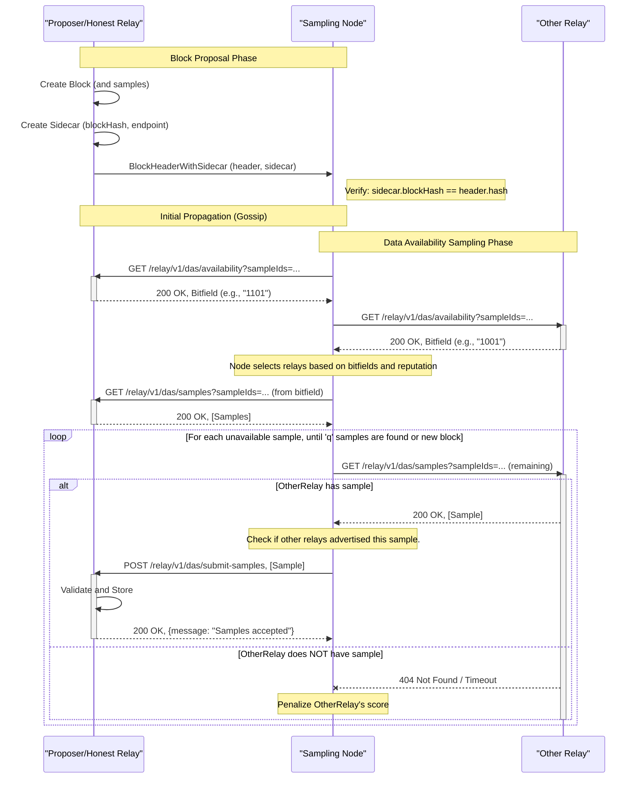

# The Unreasonable Effectiveness of Relay-Based DAS

# The Unreasonable Effectiveness of Relay-Based DAS

- The Unreasonable Effectiveness of Relay-Based DAS

Changes from Original Proposal

Benefits

[Relay/DAS Sidecar Proposal](#relaydas-sidecar-proposal)
[Proposed API](#proposed-api)
[Sample endpoint](#sample-endpoint)
[Sampling](#sampling)
[Initial sample distribution](#initial-sample-distribution)
[Citations](#citations)

This proposal is based from Dankrad’s [“Relay based data availability sampling”](https://notes.ethereum.org/NgKvvYiAQ7WdxPECCVdGUQ) draft. Differences include:

- No modification of block header, the information is propagated by supporting clients.
- Random Sampling duties are defined for L2 Sequencers/Supervisors instead of L1 Beacon clients, though this does not exclude them from participating.
- Reputation mechanism is left for future versions.
- Clarified API endpoints

In the original proposal there is a reputation system detailed , instead we can adopt a greedy behaviour equilibrium to incentivize desired behaviour. *This is not strictly necessary.*

- Sequencers exclusively submit to participating relays. This increases the participating Relay’s chance of submitting a winning block proposal. To the extent that the bundle the Relay is constructing provides additive value in the block proposal, builders will submit to it in an effort to ‘win’ a merging contest with the bundle. This increases their block bid value to the proposer.
- This exclusivity need not be to only one relay, only that it is not propagated outside the receiving relay.
- This exclusivity can be revoked if relay is under-performing regarding its DAS duties, etc.

While this is intended to first be implemented as an opt-in service for Relay’s, this can be implemented as its sidecar/service gateway outside the Relay service. We assume normal, non-optimistic Relay only.

> Verified Sample Providers can be their own encapsulated service daemon/process

## Changes from Original Proposal

Instead of adding the four fields (IPv4, IPv6, DNS, port) directly to the block header, we introduce a separate data structure, a “sidecar” (welcome to a better naming convention) that accompanies the block header during its initial propagation (specifically over the p2p network). This sidecar contains the relay’s endpoint information. Once a node receives the block header and the sidecar, it uses the information from the sidecar for data availability sampling,

### Benefits

1. Flexibility: The sidecar can be more easily modified or extended in the future without requiring a hard fork. New fields can be added to the sidecar without affecting the block header.
2. Optionality: Nodes that don’t participate in DAS (e.g., older nodes, light clients, or nodes that simply don’t want to do sampling) can entirely ignore the sidecar. They don’t need to download or process it.

[das_relay_diagram12036×2714 455 KB](https://ethresear.ch/uploads/default/f639d67fb3ca72bbf8e27a030935ec5b926fb8d3)

> Sequence Diagram Detailing the new Relay DAS Operations

**
High Res Version of the Diagram**

## Relay/DAS Sidecar Proposal

1. P2P Layer Modification:

 The p2p layer (specifically, the gossip protocol used for block propagation) needs to be extended to handle the sidecar. This could be done in a few ways:

 New Message Type: Introduce a new message type, e.g., BlockHeaderWithSidecar, that contains both the block header and the RelayEndpointSidecar. Nodes that understand this message type can process it; older nodes will ignore it.
2. Parallel Gossip: Gossip the sidecar separately from the block header, but with a strong association (using the blockHash). This might be slightly less efficient but easier to implement.
3. Mandatory/Optional: The relay sending the initial BlockHeaderWithSidecar message must send both, while the relay sending only the BlockHeader can omit it.
4. Node Logic:

 Reception: When a node receives a new block header:

 If it receives a BlockHeaderWithSidecar message, it extracts both the header and the sidecar.
5. It verifies that the blockHash in the sidecar matches the hash of the block header. If they don’t match, the sidecar is discarded.
6. If it receives only the block header (without a sidecar), it proceeds as normal, but without the block-provided endpoint information.
7. Sampling: When performing DAS, the node uses the information from the sidecar (if it received one) as the block-provided endpoint. It combines this with its list of trusted relays. Relays need not be the only peering client that the node can leverage.
8. Discarding: After the initial sampling process (or if the node is not participating in DAS), the sidecar is discarded. It is not stored persistently.
9. Relay Logic:

 When a relay proposes a block, it constructs the RelayEndpointSidecar with its current endpoint information and the hash of the block header.
10. It sends a BlockHeaderWithSidecar (or equivalent, depending on the p2p implementation) message to its peers.

## Proposed API

| Endpoint | Input | Output | Description |
| --- | --- | --- | --- |
| /relay/v1/das/availability | List [SampleId] | Bitfield (e.g., “101”) | Checks if the relay has specific samples. ‘1’ = available, ‘0’ = unavailable.prev: samplesAvailable |
| /relay/v1/das/samples | List [SampleId] | List [Sample] | Retrieves the actual data samples.prev: getSamples |
| /relay/v1/das/submit-samples | List[Sample] | (Success/Failure) | Allows nodes to upload samples to the relay.prev:sendSamples |
| /relay/v1/das/submit-block-and-samples | block List [Sample] | (Success/Failure) | Allows relays to upload samples and corresponding block to the relay.prev: sendBlockAndSamples |

>

**Node Sampling**: Each node in the network randomly selects ‘`s`’ sample IDs to check for availability.

**Querying Relays** `(/relay/v1/das/availability`): The node queries its list of trusted relays (and the block-provided endpoint) using the `samplesAvailable` endpoint, providing the s sample IDs.

**Retrieving Samples** `(/relay/v1/das/samples`): Based on the responses from the relays (bitfields), the node requests the actual data samples using the `getSamples` endpoint.

**Sharing Missing Samples** (`/relay/v1/das/submit-samples`): If a node receives a sample that was not advertised by other relays, it shares that sample with those relays using the `sendSamples` endpoint.

**Iteration and Fork Choice**: If a node doesn’t find enough samples (‘`q`’), it repeats the process. If a competing block becomes more likely to be finalized, the node switches its sampling efforts.

> The following sections are directly from, “Relay Based Data Availability Sampling”[1]

## Sample endpoint

Each node maintains a list of reliable sample endpoints. These are input by the users (defaults can be given by clients), but continuously scored by the node. It queries the 5-10 endpoints with the highest reputation, plus the block-provided endpoint for each block.

- Sample endpoints are scored according to the samples they provide. For each sample, a reasonable weight is 1/r, where r is the number of sample endpoints that have advertised the samples through samplesAvailable.

## Sampling

Upon receipt of a block, each node selects ss random samples to query. It then queries its current list of sample endpoints, plus the block-provided endpoint, using the `samplesAvailable` endpoint for all its ss samples.

Once it has replies from some or all endpoints, it starts downloading the actual samples using the `getSamples` endpoint. Whenever a sample is received that was not advertised through `samplesAvailable` by another endpoint, it is sent to that endpoint via `sendSamples`.

If not enough samples were found through this process, then this process is repeated for the unavailable samples until either

- enough samples (at least qq) are found available
- Another block has a heavier weight in the fork choice rule, at which point sampling switches to that block.

(In other words, sampling is continuously active for the latest ancestor of the current fork choice head that hasn’t been determined as available yet.)

## Initial sample distribution

When sending a block, a relay immediately streams the block and the samples to other sample endpoints it knows about, as well as making it available to its own sample endpoint (that it also advertises in its block).

- A relay has an incentive to make its samples available to as many sample endpoints as possible. While it may be tempting to make its own endpoint more reliable by initially only providing to it, this would increase the risk of the block being unavailable and is not worth the risk
- In particular, quickly distributing to many sample providers mitigates the dangers of a DOS attack

## Citations

---

**
Sequence Diagram, Figure 1**

1. “Relay Based Data Availability Sampling - Dankrad.” Ethereum Research Notes. February 16, 2025. Relay based data availability sampling - HackMD ↩︎

## Replies

**djrtwo** (2025-02-17):

Note – my intention with the original [PeerDAS post](https://ethresear.ch/t/peerdas-a-simpler-das-approach-using-battle-tested-p2p-components/16541) (as inspired by discussions with Dankrad) was to find a way to mix relay-type-entities (named consistently available super-full nodes or “DAS providers”) naturally into the p2p

I think it’s a powerful design to consider what the network looks like with assumptions around super-full nodes (a set that is likely a super-set of relays), but doesn’t tightly integrate the current “relay” further into the workflow. That is, a node could whitelist super-full nodes, bias toward sampling from them, etc, with huge gains without elevating them to a particular network function with hyper specific messages

Obviously, this leaves efficiencies on the table – such as relays streaming samples to each other.

See [DAS Providers](https://ethresear.ch/t/peerdas-a-simpler-das-approach-using-battle-tested-p2p-components/16541#das-providers-13) in my original post.

---

Why the sidecar? Is this to ensure that a node that receives the sidecar+header can *immediately* begin successful queries? Whereas if they only sample their set of relays, there might be a race condition – i.e. querying prior to that relay receiving the samples? And with the sidecar, they have at least 1 of N that can immediately respond?

---

**meridian** (2025-02-18):

Thank you for responding, let me assume regarding your point about “(not) integrating the current relay further into the workflow”

I am presuming that ePBS will be crowded out by off chain mechanisms, as such relays are here to stay.

The sidecar as you mentioned, is distinct from the Request/Response process of `DataColumnSidecarsByRoot` and `DataColumnSidecarsByRange`. The focus is not on replacing PeerDAS or providing a competing alternative for scaling Ethereum DA, its to supplement the network by providing an additional out-of-protocol delivery network. This is why there is no mention of `CustodyGroups`, Since there is no `CustodyGroup` for the relay, it makes sense I think to keep the original sampling matrix as you would need to have this to calculate the specific columns for a given `CustodyGroup`.

Having a network service with the capability of providing longer retention periods, serving alt. DA solutions, etc. within the current network regime I think makes sense. Would welcome more feedback as your response has been very helpful!

Cheers

---

**meridian** (2025-03-21):

I think the sidecar usage would be useful for this after considering your comments more thoroughly, [zDAS: Z-Order Mapped DAS - EIPs networking - Fellowship of Ethereum Magicians](https://ethereum-magicians.org/t/zdas-z-order-mapped-das/23229)

